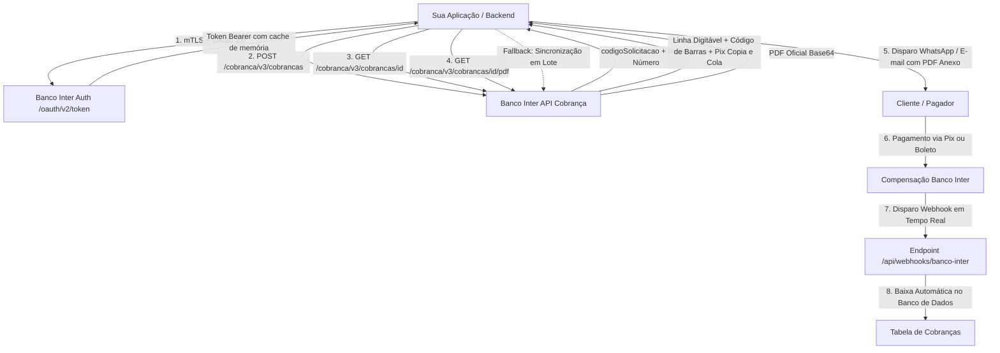

# 🏦 Manual de Implementação: Banco Inter API Cobrança v3 (Boleto com Pix / Bolepix)

Este manual é o guia definitivo e completo para integrar a **API Cobrança v3 do Banco Inter** em qualquer aplicação **Node.js, TypeScript, Next.js, Express, NestJS ou Fastify**, com suporte a **Boleto Bancário Híbrido com QR Code Pix (Bolepix)**, **Download de PDF oficial**, **Envio via WhatsApp** e **Baixa Automática em Tempo Real via Webhooks**.

---

## 📌 1. Visão Geral da Arquitetura



---

## 🔑 2. Criação da Aplicação no Internet Banking do Banco Inter

1. Acesse o **Internet Banking PJ do Banco Inter** (`https://cdpj.bancointer.com.br`).
2. No menu lateral, clique em **Conta Digital > Integrações > Nova Integração**.
3. Escolha o nome da aplicação (ex: `Meu_Sistema_Cobrancas`).
4. **Módulos Obrigatórios a Selecionar**:
   - ✅ **Cobrança / Boleto com Pix** (Permissões de **Leitura** e **Emissão/Escrita**).
   - ✅ **Webhooks** (Permissão para cadastrar o endpoint de recebimento de notificações).
5. Confirme no aplicativo do celular via **iSafe**.
6. Baixe o arquivo `.zip` disponibilizado:
   - `seu_certificado.crt` (Certificado digital público).
   - `sua_chave.key` (Chave privada do certificado).
7. Copie o **Client ID** e o **Client Secret** exibidos na tela.

---

## 💾 3. Modelagem do Banco de Dados (Prisma / SQL)

### Tabela de Configurações da Empresa / Tenant:
```prisma
model ConfiguracaoParametros {
  id                      String   @id @default(uuid())
  empresaId               String   @unique
  bancoInterAtivo         Boolean  @default(false)
  bancoInterAmbiente      String   @default("PRODUCAO") // "PRODUCAO" ou "SANDBOX"
  bancoInterClientId      String?
  bancoInterClientSecret  String?
  bancoInterCertCrt       String?  // Conteúdo texto do arquivo .crt
  bancoInterCertKey       String?  // Conteúdo texto do arquivo .key
  bancoInterContaCorrente String?  // Opcional (apenas se houver múltiplas contas)
  bancoInterWebhookUrl    String?
  createdAt               DateTime @default(now())
  updatedAt               DateTime @updatedAt
}
```

### Tabela de Cobranças / Contas a Receber:
```prisma
model ContaReceber {
  id                          String    @id @default(uuid())
  empresaId                   String
  locatarioId                 String
  valor                       Float
  dataVencimento              DateTime
  status                      String    @default("PENDENTE") // PENDENTE, PAGO, CANCELADO
  dataPagamento               DateTime?
  valorPago                   Float?
  formaPagamento              String?   // BOLETO, PIX, DINHEIRO, CARTAO
  bancoInterCodigoSolicitacao String?   // UUID retornado pelo Inter
  bancoInterNossoNumero       String?   // Nosso Número gerado pelo banco
  bancoInterCodigoBarras      String?   // Código de barras numérico
  bancoInterLinhaDigitavel    String?   // Linha digitável formatada
  bancoInterPixCopiaECola     String?   // Código Pix Copia e Cola
  bancoInterStatus            String?   // EMABERTO, RECEBIDO, CANCELADO, EXPIRADO
  bancoInterMensagemErro      String?
  createdAt                   DateTime  @default(now())
  updatedAt                   DateTime  @updatedAt
}
```

---

## 🛡️ 4. Regras Mandatórias de Validação e Especificação Técnica

Para que as requisições à API v3 do Banco Inter **nunca retornem erro HTTP 400**, siga estritamente estas 6 regras:

| Campo / Regra | Especificação Banco Inter | Tratamento Mandatório no Código |
|---|---|---|
| **Valor Mínimo** | R$ 2,50 | `if (valor < 2.50) throw new Error("Valor mínimo de R$ 2,50");` |
| **Identificador (`seuNumero`)** | Máximo 15 caracteres | `contaId.replace(/[^a-zA-Z0-9]/g, '').substring(0, 15)` |
| **Data de Vencimento** | `YYYY-MM-DD` $\ge$ Hoje | Se o vencimento estiver no passado, usar a data de hoje para emissão de cobrança imediata. |
| **Telefone do Pagador** | Separação DDD e Número | `ddd`: 2 dígitos (`87`), `telefone`: máx 9 dígitos (`996540551`). |
| **Cabeçalho `x-conta-corrente`** | Proibido em certs padrão | **NÃO** enviar `x-conta-corrente` em requisições de PDF ou contas individuais. |
| **Multa e Juros (Mora)** | Apenas valores positivos | Só incluir os blocos `multa` e `mora` no JSON se as taxas forem $> 0$. |

---

## 🚀 5. Módulo Centralizador de Integração (`src/lib/bancoInter.ts`)

O código abaixo é 100% autônomo, utiliza exclusivamente módulos nativos do Node.js (`https`, `crypto`, `querystring`) e implementa cache de token e mTLS seguro:

```typescript
import https from "https";
import querystring from "querystring";
import { prisma } from "@/lib/prisma";

export interface BancoInterConfig {
  clientId: string;
  clientSecret: string;
  certCrt: string;
  certKey: string;
  ambiente: "PRODUCAO" | "SANDBOX";
  contaCorrente?: string;
  ativo?: boolean;
}

const INTER_URLS = {
  PRODUCAO: "https://cdpj.partners.bancointer.com.br",
  SANDBOX: "https://cdpj-sandbox.partners.uatinter.co",
};

// Cache de Token OAuth em memória
const tokenCache = new Map<string, { accessToken: string; expiresAt: number }>();

export function clearInterTokenCache(empresaId?: string) {
  if (empresaId) tokenCache.delete(empresaId);
  else tokenCache.clear();
}

/**
 * Normaliza os arquivos PEM (.crt e .key), corrigindo quebras de linha e inversões acidentais
 */
export function normalizarCertificados(crt: string, key: string): { cert: string; key: string } {
  let certClean = crt.trim().replace(/\r\n/g, "\n").replace(/\r/g, "\n");
  let keyClean = key.trim().replace(/\r\n/g, "\n").replace(/\r/g, "\n");

  if (certClean.includes("PRIVATE KEY") && keyClean.includes("CERTIFICATE")) {
    const temp = certClean;
    certClean = keyClean;
    keyClean = temp;
  }

  return { cert: certClean, key: keyClean };
}

/**
 * Cria o agente HTTPS com suporte mTLS e cifras compatíveis com o Banco Inter
 */
export function createInterHttpsAgent(certCrt: string, certKey: string): https.Agent {
  const { cert, key } = normalizarCertificados(certCrt, certKey);

  return new https.Agent({
    cert,
    key,
    minVersion: "TLSv1.2",
    maxVersion: "TLSv1.3",
    ciphers: "DEFAULT:@SECLEVEL=1",
    rejectUnauthorized: true,
    keepAlive: true,
  });
}

/**
 * Executa requisição HTTP nativa com mTLS
 */
export async function makeInterRequest<T = any>({
  url,
  method,
  headers = {},
  body,
  agent,
  isBinary = false,
}: {
  url: string;
  method: "GET" | "POST" | "PUT" | "DELETE";
  headers?: Record<string, string>;
  body?: any;
  agent: https.Agent;
  isBinary?: boolean;
}): Promise<{ status: number; data: T }> {
  return new Promise((resolve, reject) => {
    try {
      const parsedUrl = new URL(url);
      let payloadData: string | undefined = undefined;
      const requestHeaders: Record<string, string> = { ...headers };

      if (body) {
        if (typeof body === "string") {
          payloadData = body;
        } else if (headers["Content-Type"] === "application/x-www-form-urlencoded") {
          payloadData = querystring.stringify(body);
        } else {
          payloadData = JSON.stringify(body);
          if (!requestHeaders["Content-Type"]) requestHeaders["Content-Type"] = "application/json";
        }
        requestHeaders["Content-Length"] = Buffer.byteLength(payloadData).toString();
      }

      const req = https.request(
        {
          hostname: parsedUrl.hostname,
          port: 443,
          path: `${parsedUrl.pathname}${parsedUrl.search}`,
          method,
          headers: requestHeaders,
          agent,
          timeout: 30000,
        },
        (res) => {
          const chunks: Buffer[] = [];
          res.on("data", (chunk) => chunks.push(Buffer.from(chunk)));
          res.on("end", () => {
            const bufferResult = Buffer.concat(chunks);
            const status = res.statusCode || 500;

            if (isBinary) {
              return resolve({ status, data: bufferResult as unknown as T });
            }

            const responseText = bufferResult.toString("utf-8");
            try {
              const json = responseText ? JSON.parse(responseText) : {};
              resolve({ status, data: json });
            } catch {
              resolve({ status, data: responseText as unknown as T });
            }
          });
        }
      );

      req.on("timeout", () => {
        req.destroy();
        reject(new Error("Tempo limite de conexão esgotado com o Banco Inter (30s)."));
      });

      req.on("error", (err) => reject(new Error(`Falha na conexão mTLS: ${err.message}`)));

      if (payloadData) req.write(payloadData);
      req.end();
    } catch (err: any) {
      reject(err);
    }
  });
}

/**
 * Obtém o Bearer Token OAuth 2.0 (com renovação automática e cache em memória)
 */
export async function getInterOAuthToken(config: BancoInterConfig, empresaId: string): Promise<string> {
  const cacheKey = empresaId;
  const cached = tokenCache.get(cacheKey);

  if (cached && cached.expiresAt > Date.now() + 60000) {
    return cached.accessToken;
  }

  const agent = createInterHttpsAgent(config.certCrt, config.certKey);
  const baseUrl = config.ambiente === "SANDBOX" ? INTER_URLS.SANDBOX : INTER_URLS.PRODUCAO;

  const bodyData = {
    client_id: config.clientId.trim(),
    client_secret: config.clientSecret.trim(),
    grant_type: "client_credentials",
    scope: "boleto-cobranca.read boleto-cobranca.write",
  };

  const res = await makeInterRequest<{ access_token?: string; expires_in?: number; error_description?: string }>({
    url: `${baseUrl}/oauth/v2/token`,
    method: "POST",
    headers: { "Content-Type": "application/x-www-form-urlencoded" },
    body: bodyData,
    agent,
  });

  if (res.status === 200 && res.data?.access_token) {
    const expiresIn = Number(res.data.expires_in || 3600);
    tokenCache.set(cacheKey, {
      accessToken: res.data.access_token,
      expiresAt: Date.now() + expiresIn * 1000,
    });
    return res.data.access_token;
  }

  throw new Error(`Falha OAuth 2.0 Banco Inter (${res.status}): ${res.data?.error_description || JSON.stringify(res.data)}`);
}

/**
 * 1. Emite a Cobrança no Banco Inter (Bolepix)
 */
export async function emitirBolepixInter(contaId: string, empresaId: string) {
  const config = await getEmpresaInterConfig(empresaId);
  const conta = await prisma.contaReceber.findUnique({
    where: { id: contaId, empresaId },
    include: { locatario: true },
  });

  if (!conta) throw new Error("Conta não encontrada.");

  const valorNominal = Number(conta.valor.toFixed(2));
  if (valorNominal < 2.50) {
    throw new Error("O valor mínimo para emissão de boleto bancário no Banco Inter é de R$ 2,50.");
  }

  const loc = conta.locatario;
  const cpfCnpjLimpo = (loc.cpf || "").replace(/\D/g, "");
  const tipoPessoa = cpfCnpjLimpo.length === 14 ? "JURIDICA" : "FISICA";

  const hojeStr = new Date().toISOString().split("T")[0];
  let vencimentoIso = new Date(conta.dataVencimento).toISOString().split("T")[0];
  if (vencimentoIso < hojeStr) vencimentoIso = hojeStr;

  // Formatação de DDD e Telefone
  const telNumeros = loc.telefone ? loc.telefone.replace(/\D/g, "") : "";
  let ddd = undefined;
  let telefone = undefined;
  if (telNumeros.length >= 10) {
    ddd = telNumeros.substring(0, 2);
    telefone = telNumeros.substring(2, 11);
  } else if (telNumeros.length > 0) {
    telefone = telNumeros.substring(0, 9);
  }

  const token = await getInterOAuthToken(config, empresaId);
  const agent = createInterHttpsAgent(config.certCrt, config.certKey);
  const baseUrl = config.ambiente === "SANDBOX" ? INTER_URLS.SANDBOX : INTER_URLS.PRODUCAO;

  const seuNumero = conta.id.replace(/[^a-zA-Z0-9]/g, "").substring(0, 15);

  const payloadInter = {
    seuNumero,
    valorNominal,
    dataVencimento: vencimentoIso,
    numDiasAgendaRecebimento: 60,
    pagador: {
      cpfCnpj: cpfCnpjLimpo,
      tipoPessoa,
      nome: loc.nome.substring(0, 100),
      endereco: (loc.endereco || "Rua Principal").substring(0, 100),
      bairro: "Centro",
      cidade: "Garanhuns",
      uf: "PE",
      cep: "55290000",
      email: loc.email || undefined,
      ddd,
      telefone,
    },
    mensagem: {
      linha1: `Aluguel Ref: ${conta.mesReferencia || "2026-09"}`,
      linha2: "Locacao de Imovel",
    },
  };

  const res = await makeInterRequest<{ codigoSolicitacao?: string; violacoes?: Array<{ razao: string }> }>({
    url: `${baseUrl}/cobranca/v3/cobrancas`,
    method: "POST",
    headers: {
      Authorization: `Bearer ${token}`,
      "Content-Type": "application/json",
    },
    body: payloadInter,
    agent,
  });

  if (res.status !== 200 && res.status !== 201) {
    const errMsg = res.data?.violacoes?.map((v) => v.razao).join("; ") || JSON.stringify(res.data);
    throw new Error(`Erro Banco Inter (${res.status}): ${errMsg}`);
  }

  const codigoSolicitacao = res.data.codigoSolicitacao!;

  // 2. Consulta imediatamente os dados completos (Linha digitável e Pix)
  const detalhes = await consultarBolepixInter(codigoSolicitacao, empresaId);

  // 3. Salva no banco de dados
  return await prisma.contaReceber.update({
    where: { id: conta.id },
    data: {
      bancoInterCodigoSolicitacao: codigoSolicitacao,
      bancoInterNossoNumero: detalhes.nossoNumero || null,
      bancoInterCodigoBarras: detalhes.codigoBarras || null,
      bancoInterLinhaDigitavel: detalhes.linhaDigitavel || null,
      bancoInterPixCopiaECola: detalhes.pixCopiaECola || null,
      bancoInterStatus: "EMABERTO",
      bancoInterMensagemErro: null,
    },
  });
}

/**
 * 2. Consulta Detalhes de uma Cobrança
 */
export async function consultarBolepixInter(codigoSolicitacao: string, empresaId: string) {
  const config = await getEmpresaInterConfig(empresaId);
  const token = await getInterOAuthToken(config, empresaId);
  const agent = createInterHttpsAgent(config.certCrt, config.certKey);
  const baseUrl = config.ambiente === "SANDBOX" ? INTER_URLS.SANDBOX : INTER_URLS.PRODUCAO;

  const res = await makeInterRequest({
    url: `${baseUrl}/cobranca/v3/cobrancas/${codigoSolicitacao}`,
    method: "GET",
    headers: { Authorization: `Bearer ${token}` },
    agent,
  });

  if (res.status !== 200) throw new Error(`Falha ao consultar cobrança (${res.status})`);

  return {
    codigoSolicitacao,
    situacao: res.data.cobranca?.situacao || res.data.situacao,
    dataVencimento: res.data.cobranca?.dataVencimento,
    valorNominal: res.data.cobranca?.valorNominal,
    valorTotalRecebido: res.data.cobranca?.valorTotalRecebido || res.data.cobranca?.valorRecebido,
    dataPagamento: res.data.cobranca?.dataHoraSituacao || res.data.cobranca?.dataPagamento,
    linhaDigitavel: res.data.boleto?.linhaDigitavel || res.data.linhaDigitavel,
    codigoBarras: res.data.boleto?.codigoBarras || res.data.codigoBarras,
    nossoNumero: res.data.boleto?.nossoNumero || res.data.nossoNumero,
    pixCopiaECola: res.data.pix?.pixCopiaECola || res.data.pixCopiaECola,
  };
}

/**
 * 3. Download do PDF Oficial (Sem x-conta-corrente)
 */
export async function baixarPdfBoletoInter(codigoSolicitacao: string, empresaId: string): Promise<string> {
  const config = await getEmpresaInterConfig(empresaId);
  const token = await getInterOAuthToken(config, empresaId);
  const agent = createInterHttpsAgent(config.certCrt, config.certKey);
  const baseUrl = config.ambiente === "SANDBOX" ? INTER_URLS.SANDBOX : INTER_URLS.PRODUCAO;

  const res = await makeInterRequest({
    url: `${baseUrl}/cobranca/v3/cobrancas/${codigoSolicitacao}/pdf`,
    method: "GET",
    headers: { Authorization: `Bearer ${token}` },
    agent,
    isBinary: true,
  });

  if (res.status !== 200) throw new Error(`Erro ao baixar PDF (${res.status})`);

  const buffer = res.data as unknown as Buffer;
  if (buffer.toString("utf-8").startsWith("{")) {
    const json = JSON.parse(buffer.toString("utf-8"));
    if (json.pdf) return json.pdf;
  }

  return buffer.toString("base64");
}

/**
 * 4. Registro de Webhook no Banco Inter (Retorna HTTP 204)
 */
export async function registrarWebhookInter(webhookUrl: string, empresaId: string) {
  const config = await getEmpresaInterConfig(empresaId);
  const token = await getInterOAuthToken(config, empresaId);
  const agent = createInterHttpsAgent(config.certCrt, config.certKey);
  const baseUrl = config.ambiente === "SANDBOX" ? INTER_URLS.SANDBOX : INTER_URLS.PRODUCAO;

  const res = await makeInterRequest({
    url: `${baseUrl}/cobranca/v3/cobrancas/webhook`,
    method: "PUT",
    headers: {
      Authorization: `Bearer ${token}`,
      "Content-Type": "application/json",
    },
    body: { webhookUrl },
    agent,
  });

  if (res.status !== 200 && res.status !== 204) {
    throw new Error(`Erro ao registrar Webhook (${res.status}): ${JSON.stringify(res.data)}`);
  }

  return { success: true, message: "Webhook registrado com sucesso!" };
}
```

---

## ⚡ 6. Endpoint do Webhook de Baixa Automática (`src/app/api/webhooks/banco-inter/route.ts`)

Quando o cliente efetua o pagamento via Pix ou código de barras, o Banco Inter notifica o endpoint instantaneamente:

```typescript
import { NextRequest, NextResponse } from "next/server";
import { prisma } from "@/lib/prisma";

export async function POST(request: NextRequest) {
  try {
    const payload = await request.json();
    const eventos = Array.isArray(payload) ? payload : [payload];

    for (const evento of eventos) {
      const codigoSolicitacao = evento.codigoSolicitacao;
      const situacao = evento.situacao; // "RECEBIDO" ou "PAGO"

      if (codigoSolicitacao && (situacao === "RECEBIDO" || situacao === "PAGO")) {
        const conta = await prisma.contaReceber.findFirst({
          where: { bancoInterCodigoSolicitacao: codigoSolicitacao },
        });

        if (conta && conta.status !== "PAGO") {
          await prisma.contaReceber.update({
            where: { id: conta.id },
            data: {
              status: "PAGO",
              bancoInterStatus: "RECEBIDO",
              formaPagamento: evento.origemRecebimento === "PIX" ? "PIX" : "BOLETO",
              valorPago: Number(evento.valorTotalRecebido || conta.valor),
              dataPagamento: evento.dataHoraSituacao ? new Date(evento.dataHoraSituacao) : new Date(),
            },
          });
        }
      }
    }

    return NextResponse.json({ success: true, message: "Webhook processado com sucesso" });
  } catch (error: any) {
    return NextResponse.json({ error: error.message }, { status: 500 });
  }
}
```

---

## 📥 7. Rota de Download do PDF Oficial (`src/app/api/banco-inter/pdf/route.ts`)

Permite visualizar o boleto em nova aba ou disparar o download com o nome formatado:

```typescript
import { NextRequest, NextResponse } from "next/server";
import { baixarPdfBoletoInter } from "@/lib/bancoInter";
import { prisma } from "@/lib/prisma";

export async function GET(request: NextRequest) {
  const { searchParams } = new URL(request.url);
  const contaId = searchParams.get("contaId");
  const codigoSolicitacao = searchParams.get("codigoSolicitacao");

  let codSol = codigoSolicitacao || "";
  let empresaId: string | null = null;

  if (contaId) {
    const conta = await prisma.contaReceber.findUnique({ where: { id: contaId } });
    if (conta) {
      empresaId = conta.empresaId;
      codSol = conta.bancoInterCodigoSolicitacao || codSol;
    }
  } else if (codSol) {
    const conta = await prisma.contaReceber.findFirst({ where: { bancoInterCodigoSolicitacao: codSol } });
    if (conta) empresaId = conta.empresaId;
  }

  if (!empresaId || !codSol) {
    return NextResponse.json({ error: "Cobrança não encontrada ou inválida." }, { status: 400 });
  }

  try {
    const pdfBase64 = await baixarPdfBoletoInter(codSol, empresaId);
    const pdfBuffer = Buffer.from(pdfBase64, "base64");

    return new NextResponse(pdfBuffer, {
      status: 200,
      headers: {
        "Content-Type": "application/pdf",
        "Content-Disposition": `inline; filename="boleto_${codSol}.pdf"`,
      },
    });
  } catch (error: any) {
    return NextResponse.json({ error: error.message || "Erro ao obter PDF." }, { status: 500 });
  }
}
```

---

## 📱 8. Envio de Boleto + Pix via WhatsApp (Evolution API)

Para disparar o boleto PDF anexado e as linhas de código digitável e Pix Copia e Cola pelo WhatsApp do cliente:

```typescript
// Exemplo de chamada no Frontend React:
const handleEnviarWhatsApp = async (conta: any) => {
  const pdfRes = await fetch(`/api/banco-inter/pdf?contaId=${conta.id}`);
  const pdfBlob = await pdfRes.blob();

  const reader = new FileReader();
  reader.onloadend = async () => {
    const base64data = (reader.result as string).split(",")[1];

    const mensagem = 
      `*BOLETO E PIX DE ALUGUEL* 🏢\n\n` +
      `Olá, *${conta.locatario.nome}*!\n` +
      `Informamos os dados para pagamento:\n` +
      `💰 *Valor*: R$ ${conta.valor.toFixed(2)}\n` +
      `📅 *Vencimento*: ${new Date(conta.dataVencimento).toLocaleDateString("pt-BR")}\n\n` +
      `📄 *Linha Digitável*:\n\`${conta.bancoInterLinhaDigitavel}\`\n\n` +
      `🔑 *Pix Copia e Cola*:\n\`${conta.bancoInterPixCopiaECola}\`\n\n` +
      `_O boleto em PDF oficial com o QR Code está em anexo!_`;

    await fetch("/api/whatsapp/send", {
      method: "POST",
      headers: { "Content-Type": "application/json" },
      body: JSON.stringify({
        phone: conta.locatario.telefone,
        message: mensagem,
        pdfBase64: base64data,
        fileName: `Boleto_Inter_${conta.bancoInterNossoNumero || conta.id.substring(0, 8)}.pdf`,
      }),
    });
    alert("✅ Boleto e Pix enviados com sucesso pelo WhatsApp!");
  };
  reader.readAsDataURL(pdfBlob);
};
```

---

## 🚨 9. Guia de Diagnóstico e Resolução de Erros (Troubleshooting)

### 1. Erro mTLS `SSL routines:ssl3_read_bytes:tlsv1 alert unknown ca` (Alert 48)
- **Causa**: Certificado `.crt` e chave `.key` pertencem a ambientes diferentes (ex: cert de Produção testado em Sandbox), ou estão invertidos nos inputs.
- **Solução**: Use a função `normalizarCertificados` e certifique-se de selecionar o ambiente `PRODUCAO` para certificados emitidos pelo Portal PJ.

### 2. Erro OAuth `requested scope is not registered for this client` (401)
- **Causa**: Ao criar a aplicação no Banco Inter, a opção **Cobrança / Boleto com Pix** ou **Webhooks** não foi selecionada.
- **Solução**: No Internet Banking PJ > Conta Digital > Integrações > Minhas Aplicações, edite a aplicação e marque o escopo de **Cobrança**.

### 3. Erro `O valor deve ser maior ou igual a 2.5` (400)
- **Causa**: Tentativa de emitir um boleto com valor inferior a R$ 2,50 (ex: R$ 1,00).
- **Solução**: O Banco Inter e a FEBRABAN estabelecem o piso mínimo de R$ 2,50 para viabilidade de compensação bancária.

### 4. Erro `O tamanho deve estar entre 0 e 15` no `seuNumero` (400)
- **Causa**: Passar IDs longos (ex: UUIDs com mais de 15 caracteres) no campo `seuNumero`.
- **Solução**: Aplicar `id.replace(/[^a-zA-Z0-9]/g, '').substring(0, 15)`.

### 5. Erro 400 ao Baixar o PDF
- **Causa**: Envio do cabeçalho `x-conta-corrente` na requisição do endpoint `/pdf`.
- **Solução**: Manter apenas o cabeçalho `Authorization: Bearer <TOKEN>` na chamada de download do PDF.
